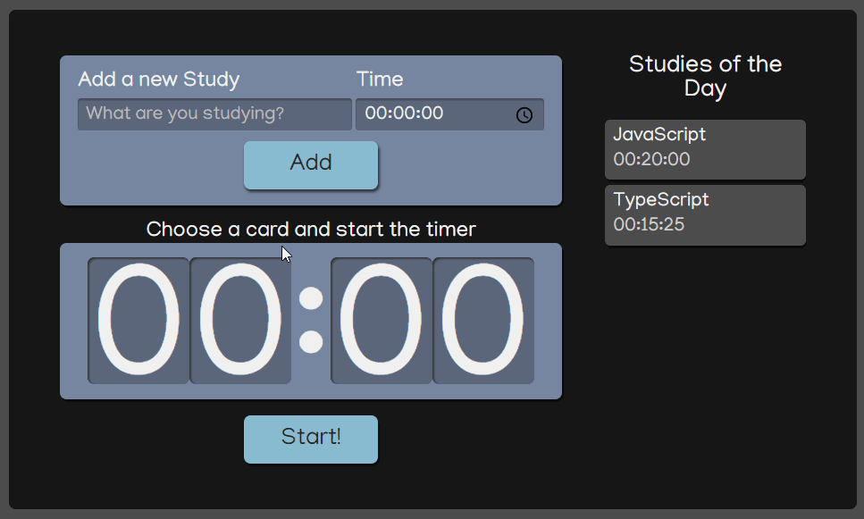

## To run the project on browser
#
In the project directory, you can run:

### `npm start`
#
## How does it work?
It's an application to add studies tasks and its respective intended time to be spent studying in each os them.
The user will have a list of the added tasks and they can be individually chosen to apply its time to the timer which will be set when the start button is clicked.
An alert will be shown when the task time reaches 00:00, showing that the selected task is finished.

